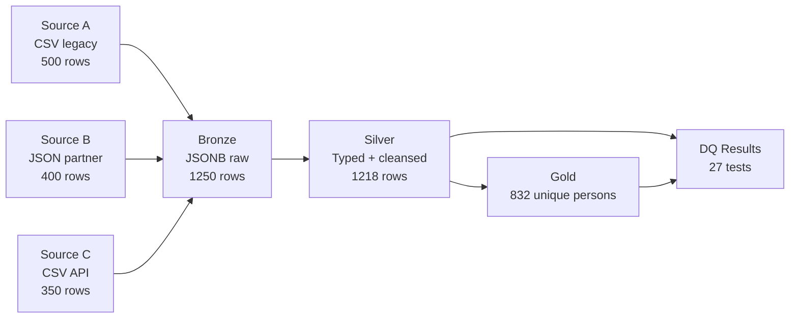

# MemberMatch

Healthcare member data reconciliation pipeline. Ingests records from
three heterogeneous source systems, cleanses and normalizes them via
a bronze/silver/gold medallion architecture, and produces unified
golden records via SQL window functions and composite match keys.

[](https://github.com/AhmedKamal-41/membermatch/actions/workflows/ci.yml)


## Architecture



## Why this project

Two things make this more than a toy ETL:

1. **Real SQL.** The bronze-to-silver transform parses three different
   JSONB schemas side-by-side with source-specific format handling:
   multi-format date parsing (ISO, MM/DD/YYYY, Unix timestamps including
   negative for pre-1970 DOBs), plan code normalization across three
   distinct vocabularies, leading-zero ZIP restoration via LPAD, and
   INITCAP + TRIM cleansing. The silver-to-gold transform uses
   ROW_NUMBER() with priority-ordered deduplication to pick a winner
   per match key.

2. **Data quality as a test layer.** 27 DQ tests across four categories
   (uniqueness, completeness, referential, format). Every test run
   writes to a `dq.test_results` table with a failure sample, mirroring
   how real data teams track DQ over time.

## Testing Strategy

| Category | Count | Checks |
|---|---|---|
| Ingestion | 3 | Row counts, JSONB payload shape, idempotency |
| Transform | 3 | Silver cardinality, unique source IDs, match key format |
| Golden | 3 | Gold cardinality, dedup priority, lineage tracking |
| DQ: Uniqueness | 7 | Duplicate prevention across all layers |
| DQ: Completeness | 9 | NULL enforcement on required fields |
| DQ: Referential | 4 | FK integrity + domain constraints |
| DQ: Format | 7 | Regex + TRIM + case validation |
| Pipeline E2E | 4 | Idempotency, reduction ratio, DQ logging |

**Total: 37 tests.** All pass against a fresh Postgres container in CI.

## Quick Start

### Prerequisites
- Python 3.11+
- Docker + Docker Compose
- psql (`apt install postgresql-client` or `brew install libpq`)

### Run the pipeline

```bash
docker compose up -d
pip install -r requirements.txt && pip install -e .
python scripts/generate_synthetic_data.py
./scripts/apply_migrations.sh
python -m membermatch.pipeline
```

Expected output:
```
Bronze:   1250 rows
  source_a: 500
  source_b: 400
  source_c: 350
Silver:   1218 rows (typed/cleansed)
Gold:     832 rows (unique persons)
Lineage:  1218 rows
Reduction: 1.50x
```

### Run tests

```bash
pytest -v
```

## The SQL worth reading

Two queries contain most of the interesting work:

- [`sql/queries/dedup_members.sql`](sql/queries/dedup_members.sql) — bronze-to-silver
  transform: 3-source JSONB parsing, CTE-based cleansing, composite match key,
  handles ISO / MM-DD-YYYY / Unix-timestamp (including negative for pre-1970)
  date formats.
- [`sql/queries/golden_record.sql`](sql/queries/golden_record.sql) — silver-to-gold
  materialization: ROW_NUMBER() windowed deduplication with source priority
  (source_a > source_c > source_b), with lineage tracking in
  gold.member_sources.

## Data Quality Results

Every test run logs to `dq.test_results`:

```sql
SELECT category, COUNT(*) AS total_runs,
       SUM(CASE WHEN passed THEN 1 ELSE 0 END) AS passed,
       SUM(failed_row_count) AS total_failing_rows
FROM dq.test_results
GROUP BY category
ORDER BY category;
```

The `failure_sample` column stores JSONB of the first 5 failing rows
for triage. In a real data team, this table would feed a DQ dashboard.

## Tech Stack

| Layer | Tech |
|---|---|
| Runtime | Python 3.11+ |
| Database | PostgreSQL 16.13 |
| SQL tooling | Raw SQL via psycopg 3 |
| Testing | pytest 8 |
| Data generation | Faker with deterministic seed |
| CI/CD | GitHub Actions |

## Known Limitations / Roadmap

- **No fuzzy matching.** Current match key is deterministic
  (lower(last_name) + DOB + ssn_last4). Real reconciliation would use
  fuzzy name matching via RapidFuzz (already in requirements) for cases
  where SSN is missing or names are misspelled beyond case variation.
- **Truncate-and-reload pattern.** Pipeline truncates all layers before
  each run for simplicity. Production would use incremental load via
  change data capture (CDC) or per-source watermarks.
- **No BI dashboard.** Gold tables are query-ready but not exposed via
  a reporting tool. Metabase or Power BI would be the natural next layer.
- **Pre-1970 DOB quarantine.** Unix-timestamp birthdates before 1970
  are negative integers. The silver regex currently rejects them
  (~3% of source_c rows) and they fall out of the pipeline. A
  production system would quarantine these to a separate table for
  manual review.

## License

MIT
